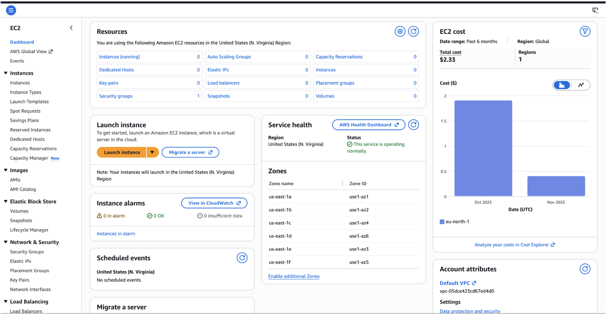
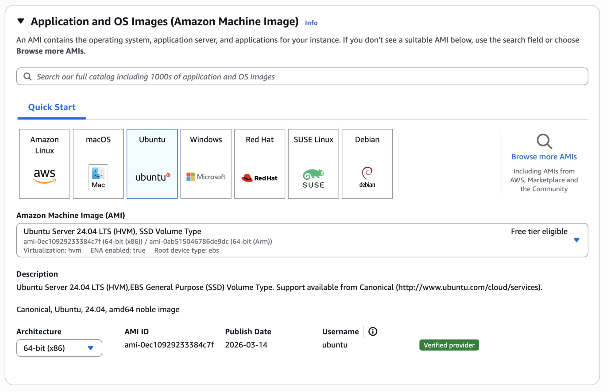
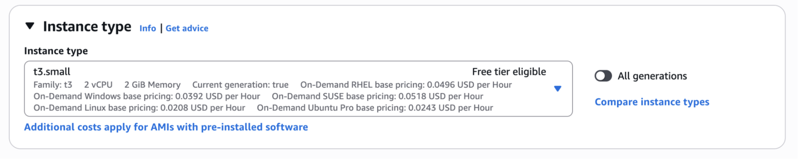
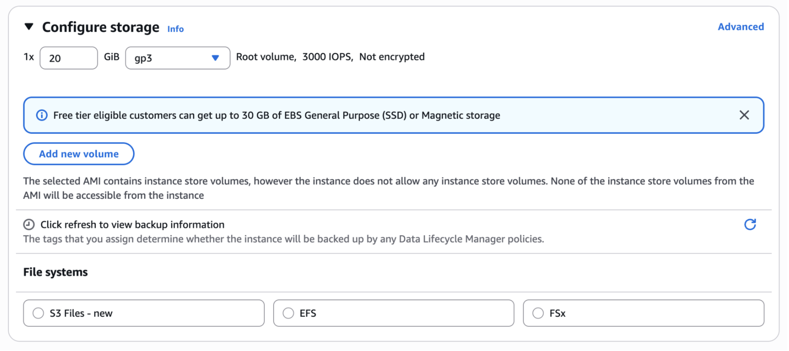
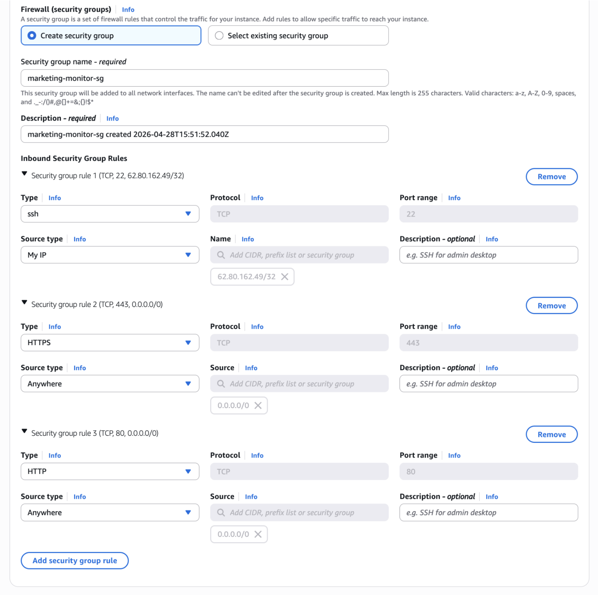
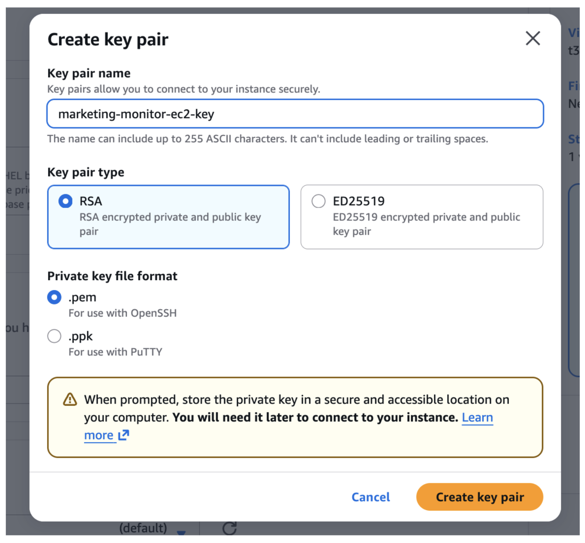

# AWS Deploy explanation

## Overview

**Live demo:** http://34.226.244.231

Launching EC2 instance
To deploy the application on AWS, I used a simple single-instance infrastructure based on Amazon EC2. 
Since this was a lightweight full-stack application intended for evaluation rather than high-scale production traffic, the goal was to keep the deployment simple, cost-effective, and easy to maintain while still following standard deployment practices.

## Launching the EC2 Instance


A new EC2 instance was created through the AWS Console.



## EC2 Configurations

I selected Ubuntu Server 24.04 LTS as the operating system. Ubuntu was chosen because it is one of the most stable and commonly used Linux distributions for application hosting, with strong community support and predictable package management.



For the instance type, I selected t3.small. This configuration provides:
* 2 vCPUs
* 2 GB RAM

This was sufficient for the application because the deployment included:
* a frontend container
* a backend container
* a headless browser process (Puppeteer)


The additional memory compared to smaller instance types (such as t3.micro) was important because Puppeteer requires noticeably more RAM than a standard API service.
  


For storage, I allocated 20 GB gp3 EBS volume. This was enough for:
* the operating system
* Docker images and containers
* application logs
* temporary runtime files


The gp3 volume type was selected because it provides a good balance between cost and performance for general-purpose workloads.
  


During instance creation, I configured a dedicated Security Group to control inbound traffic.
I allowed the following inbound rules:
* Port 22 (SSH) – restricted to my IP address only
* This was required for secure remote access to the server and restricted to a single trusted source for security reasons.
* Port 80 (HTTP) – open to the internet
* This allowed the application to be accessed publicly through the browser.
* Port 443 (HTTPS) – open to the internet

This was prepared in advance for SSL termination and secure HTTPS access later in the setup.

I intentionally did not expose application-level ports such as 3000, 8000, or 5432 publicly. Those ports were kept internal and only accessed through Docker networking and reverse proxy routing. This is a standard security practice to reduce the public attack surface.
  


To securely connect to the EC2 instance, I created a new RSA key pair during provisioning and downloaded the .pem private key.

This key was used for SSH authentication instead of password-based login, which is the recommended and more secure approach for server access.



---

## EC2 Connection

After launching the EC2 instance, I connected to the server via SSH using the private .pem key generated during instance creation.


First, I retrieved the instance’s public IPv4 address from the AWS EC2 console. Then I used the downloaded private key to establish a secure SSH connection from my local machine.


Before connecting, I updated the file permissions of the private key to ensure it was only readable by the current user, which is required by SSH:

```bash
chmod 400 marketing-monitor-ec2-key.pem
```

Then connected via:

```bash
ssh -i marketing-monitor-ec2-key.pem ubuntu@<EC2_PUBLIC_IP>
```

This authenticated the session using key-based SSH access rather than password authentication, which is significantly more secure and avoids exposing credentials over the network.

Using SSH key authentication reduced the risk of brute-force login attempts and followed standard security practices for remote server access.

---

## Server Setup

After connecting to the instance, the server was prepared in the following steps:

1. **Updated system packages** — ensured the server was running in a stable, up-to-date state with the latest security patches.

2. **Installed Docker** — used as the primary runtime for both services. Docker ensures the full stack runs consistently across environments.

3. **Configured Docker permissions** — added the `ubuntu` user to the `docker` group so Docker commands can run without `sudo`.

4. **Installed Git and cloned the repository** — pulled the application source directly onto the server to build and run it from source.

5. **Created the production environment file** — copied `.env.example` to `.env` and filled in the required runtime values (API credentials, service configuration, secrets).

6. **Started the application** — launched the full stack with Docker Compose in detached mode:

```bash
docker compose up -d --build
```

Both frontend and backend services run as isolated containers on the EC2 instance.

---

## Architecture on EC2

```
EC2 instance (Ubuntu, t3.small)
└── Docker Compose
    ├── frontend container  — nginx on port 80 (public)
    │     serves React static files + proxies /api/* to backend
    └── backend container   — Express on port 3001 (internal only)
          handles API requests and runs Puppeteer screenshots
```
